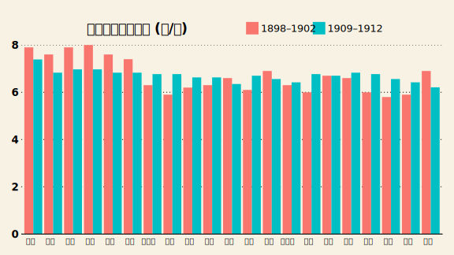
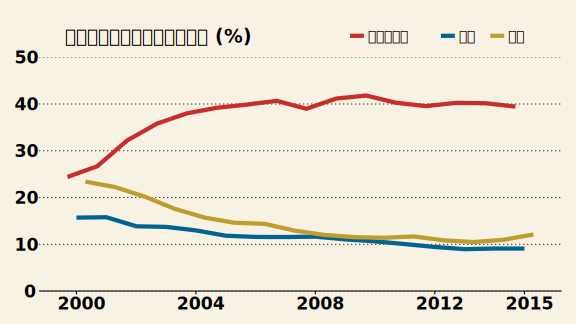
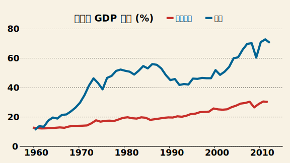

# TalkEcon.com Graph Style

## Usage

1. Download and unzip [TalkEcon_Graph.zip](TalkEcon_Graph.zip)
2. Make sure to install all the needed packages in R
  ```
  install.packages("ggplot2", dependencies = TRUE)
  install.packages("ggthemes", dependencies = TRUE)
  install.packages("reshape2", dependencies = TRUE)
  install.packages("svglite", dependencies = TRUE)
  ```
3. Open `graph.R`, change the working directory (`setwd`) if needed, and execute.
4. Check the outputs are consistent with the following graphs. 


rice_price.svg


export_gph.svg


third_gph.svg
